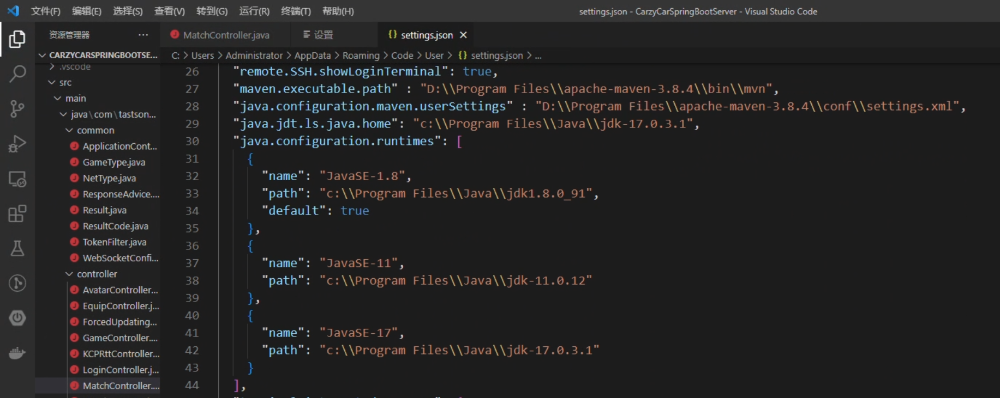

# CrazyCar

## 视频教程

### [一、前端环境](https://www.bilibili.com/video/BV1se4y1f7fZ?share_source=copy_web&vd_source=f8cee64c485579bb7cc03c9b2d573b0a)


### 二、服务端环境

#### 2.1 [数据库](https://www.bilibili.com/video/BV1Ua411V7zV)


#### 2.2  [Java环境](https://www.bilibili.com/video/BV1pB4y1V7CL)


#### 2.3  [VSCode](https://www.bilibili.com/video/BV17g411r7dk?share_source=copy_web&vd_source=f8cee64c485579bb7cc03c9b2d573b0a)


### 三、[后台环境](https://www.bilibili.com/video/BV1s14y1t7xS)


## 运行

1. 用**Unity**(2021.3.1及以上)打开**CrazyCar -> CrazyCar**项目；

2. 在**Unity**中设置**Login**场景中的**NetworkController**，设置成**Local**(当然你不愿意部署服务器，也可以使用**Remote**，那就可以跳过下面所有的步骤)；

3. 启动**Mysql**，并运行**CrazyCar -> CrazyCarDB**中的**CrazyCar.sql**脚本，部署数据库，注意账号和密码需要和[配置文件](./CarzyCarSpringBootServer/src/main/resources/application.properties)保持一致

4. 配置Java环境(JDK17)：[官网下载JDK17](https://www.oracle.com/java/technologies/javase/jdk17-archive-downloads.html) *(win10请下载exe,Mac下载dmg**不要**下载zip自己配置)*-->配置系统环境变量  [详细教程](https://www.runoob.com/java/java-environment-setup.html)

5. 配置Maven环境：[官网下载](https://maven.apache.org/download.cgi) --> 配置环境变量  [详细教程](https://www.runoob.com/maven/maven-setup.html)

6. VScode安装Spring Boot开发插件：Extension Pack for Java、Spring Initializr Java Support、Maven for Java、Community Server Connectors(原Tomcat)、Lombok

7. VS code配置Java和Maven路径*(此路径为在Editor运行时的加载路径，打包时需要本地环境变量配置好maven与jdk相关路径)*，Mac 和Windows示例如下：

   

   

8. 使用VScode打开文件夹：CarzyCarSpringBootServer，F5启动项目

9. 服务端运行成功后，即可运行**Unity**客户端；

> 1. 如果你是第一次部署服务器，可能会出现Mysql运行脚本、VScode配置Java、Maven环境加载失败等问题，请自行Google！
> 2. 游戏支持单机模式，如果你没有服务器，也可以进行打版测试(直接Build出版本就行)
> 2. [Apifox](https://www.apifox.cn/apidoc/shared-f1aa2fc5-8e30-46a8-9218-6c1cb96da3b7)接口测试分享

10. 安装[nodejs](https://nodejs.org/en/)，使用VScode打开文件夹：CrazyCarBackground，然后在终端运行npm install安装依赖，最后使用npm run dev运行即可 (此模块按需求部署即可，[详细操作文档](https://panjiachen.gitee.io/vue-element-admin-site/zh/guide/))

## 环境版本

1. Unity 2021.3.9
2. VS 2019
4. JDK 17
5. MySQL 8.0.26
6. Tomcat 8.0.52
8. Nginx  1.20.1
8. Nodejs 16.16.0

## 环境配置

* 服务器配置流程（windows）

  ```mermaid
  graph LR
  start-->购买服务器-->配置Java环境-->配置Web服务器(Tomcat)-->配置Mysql
  ```

  

* 客户端配置流程（Windows/Mac）

  ```mermaid
  graph LR
  start-->配置Java环境-->配置Maven环境-->配置Web服务器(Tomcat)-->配置Mysql-->配置VScode开发环境-->安装Unity
  ```

  

* 配置服务器基本属性a

  1. 购买云服务器 [华为云](https://www.huaweicloud.com/?locale=zh-cn)

  2. 设置云服务的安全组[入口](https://console.huaweicloud.com/lcs/?agencyId=0d551b5ba600f5841fd4c0182c6aa4b6&region=cn-south-1&locale=zh-cn#/lcs/manager/vmList/vmDetail/securitygroups?instanceId=410b1a5b-ee07-434a-8fea-c2c6e3b54a7d) ，华为云初始化会有三个安全组，其中有一个Web Server组是用来做Web开发的，它已经把80、443等网络端口开放，当然也可以自己去设定比如开放8080(Tomcat)、8081(Spring Boot服务端)、50001(KCP设置端口)、3389(Mysql)

## 游戏引擎

**Unity 2021.3.9 及以上**

## 添加新的热更类型

*以添加新类型Medal(勋章)为例*

1. **CrazyCar\CrazyCar\Assets\AB**文件夹下添加新的文件夹**Medal**
2. 相应的资源放入此文件夹
3. 打开**Windows -> Asset Management -> Groups**窗口
4. 点击**Create**创建新的**Group**，命名为**Medal**
5. 将资源拖入此分组
6. 点击**Build -> New Build**，进行生成增量包  (请自行百度**Addressable**了解生成新包和增量包的区别)
7. 将**CrazyCar\CrazyCar\Assets\StreamingAssets**下生成的包放入**CrazyCar\CrazyCarServer\src\main\webapp**重新生成**War/Jar**包发布到服务端即可
7. 具体分组的参数设置可以查看[此文章](./ProjectOptimization/Addressable.md)

## 添加头像

1. 将头像放入**Assets -> AB -> Avatar** 文件夹
2. 将新头像拖入**Windows -> Asset Management -> Groups**窗口，中的**Avatar**分组
3. 在数据库**avatar_name**表中添加新的头像信息，ID字段为头像名
4. 运行Unity，进行查看
5. 点击**Build -> New Build**，进行生成新包
6. 将**CrazyCar\CrazyCar\ServerData**下生成的包放入**CrazyCar\CrazyCarServer\src\main\webapp**重新生成**War/Jar**包发布到服务端即可

## 自动化打版

1. Android、PC和IOS都是直接点击**Window--> Build -->Local**(过程中会让你选择目标文件夹)，进行打版，**Remote**为使用线上服务器。
2. 如果没有服务器，游戏支持单机模式，但是只能使用主功能，直接使用**File --> BuildSettings --> Build**即可。

## 添加装备

1. 复制一个**CrazyCar --> CrazyCar --> Assets --> AB --> Equip--> Items**文件夹下个任意一个**Prefab** ，并重命名
2. 将你的装备的**Icon**、**Material**、**Mesh**放入**CrazyCar --> CrazyCar --> Assets --> AB --> Equip**对应的文件夹
3. 双击开你的**Prefab**修改**Prefab**对应的信息，在复制好的基础上进行处理你要添加你的装备(当然你也可以重新制作一个新的，最后将EquipResource脚本放在根节点，并填好信息即可)
4. 将新装备**prefab**拖入**Windows -> Asset Management -> Groups**窗口，中的**Equip**分组
5. 在数据库**all_equip**表中添加装备信息
6. 运行Unity，进行查看
7. 点击**Build -> New Build**，进行生成新包
8. 将**CrazyCar\CrazyCar\ServerData**下生成的包放入**CrazyCar\CrazyCarServer\src\main\webapp**重新生成**War/Jar**包发布到服务端即可

## 增加TimeTrial关卡

1. 在数据库**time_trial_class**表中添加关卡信息即可

   > map_id为0-4，因为现在就5张图

## 增加比赛

1. 在数据库**match_class**表中添加关卡信息即可

> map_id为0-4，因为现在就5张图

## 添加地图

1. 在**Unity**中打开**MapController.prefab**，添加你的地图

2. 将新图拖入到**MapController**中的**MapsGO**中

3. 从**Map0**中复制一份**CheckpointController**，到新地图，并将**CheckpointController**里面的**Checkpoint**和**EndSign**，移动到相应的位置

4. 从**Map0**中复制一份**MiniMap**，到新地图，将**MiniMap**下**Plane**中的**Material**换成新地图的素材

5. 打开**Game**场景，将新地图的**Scale**调整的和现有地图大小相似

6. 地图的起点位置为，**Game**场景中**StartPos**所在的位置

7. 添加路线

   * 添加Path空物体

   * 在Path空物体下添加空物体PathCreator

   * 给PathCreator添加PathCreator组件

   * 通过Shift+左鼠标键添加节点，Ctrl+左鼠标键删除节点，制作地图路线 

     > 详情操作可以查看[Path Creator - Google 文档](https://docs.google.com/document/d/1-FInNfD2GC-fVXO6KyeTSp9OSKst5AzLxDaBRb69b-Y/edit#heading=h.gnp37l55xf4w)

8. 可以在**TimeTrial**添加相应的关卡进行测试

## 添加多语言

1. 打开**Tools --> Translate**窗口

   

2. 输入要翻译的文案数量以及内容，点击**显示翻译**按钮

3. 查看翻译内容是否合适

4. 点击添加**翻译按钮**，文案就会自动添加到**CrazyCar\CrazyCar\Assets\Resources\Language\Locales**对应的文件里

## 添加新手教程

1. 在需要添加新手教程的页面添加**Guidance**预制体

   

2. 设置**Guidance**参数

    

   * **CanvasType**
     **Guidance**组件需要提供UI所在的父物体**Canvas**组件，在**Index**场景是通过**UIController**脚本管理所以页面，如果新增页面，有新的Canvas，需要在**GuidanceSystem**脚本进行添加并赋值，可以参考**UIController**操作过程

   * **GuidanceType**

     可以设置点击区域是圆形还是矩形

   * **IsClick**

     区域是否需要点击功能，如**AvatarUI**的这个关闭按钮不需要实现关闭**AvatarUI**页面功能，则不勾选
     
   * 每个**Guidance**都需要新建一个**Material**(复制一份现有的**AvatarGuidanceMat**重命名就可以)
   
   *注：完成标识符为**UserModel**中的**IsCompleteGuidance**，完成条件为点击**计时赛按钮***
